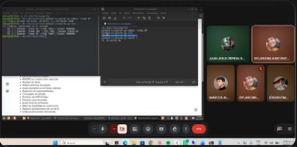
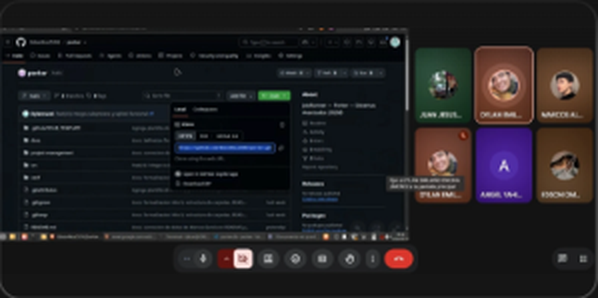
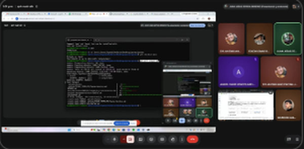

# Minuta — Junta 1

| | |
|---|---|
| **Fecha** | Miércoles 16 de septiembre de 2026 |
| **Hora** | Alrededor de las 15:20 a 15:30 (según la evidencia) |
| **Medio** | Google Meet |
| **Asistentes** | Dylan Emiliano Encina Jimenez, Juan Jesus Zepeda Briseno, Angel Yahir Vences Arellano, Marcos Alberto de Jesus Garcia Espino, Edson Omar Ruiz Verduzco |

## Objetivo

Declarar los roles del equipo y revisar lo correspondiente al Avance 00 (formación de equipo y repositorio).

## Temas tratados

1. Roles y responsabilidades de cada integrante.
2. Estado del repositorio después del Avance 00 y forma de obtenerlo (clonar y actualizar).
3. Demostración del primer prototipo de línea de comandos.

## Lo que muestra la evidencia

| Imagen | Qué se ve |
|---|---|
| `junta1-01.png` | Dylan comparte su terminal: envía un trabajo con `python3 src/porter.py submit "sleep 30"` y lo lista; aparecen trabajos en estado `RUNNING` y `CANCELLED`. Al fondo, la lista de entregables del Avance 01 |
| `junta1-02.png` | Repositorio `EdsonRuiz5392/porter` en GitHub, con la opción *Clone* y la dirección HTTPS para clonarlo |
| `junta1-03.png` | Juan comparte su terminal: `git pull origin main` trae `.gitattributes`, la plantilla de issues, README, el ADR de lenguaje, la matriz de roles y `src/porter.py` (6 archivos) |

## Actividad relacionada en el repositorio

- Ese día se mezcló el PR #9 (plantilla de issues y `.gitattributes`) y Dylan subió el prototipo del CLI con `subprocess` y SQLite (`56db2c2`).
- El día anterior se habían cerrado los issues #1 a #5 y #7; ese día se cerró el #8.

## Acuerdos

- Roles del equipo declarados y registrados en `project-management/roles-matrix.md`.
- Todos los integrantes clonan el repositorio y lo mantienen actualizado con `git pull`.

_Acuerdos adicionales, responsables y fechas: por completar por el equipo._
