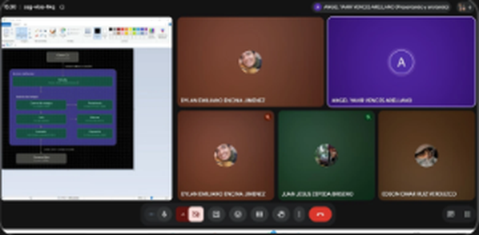
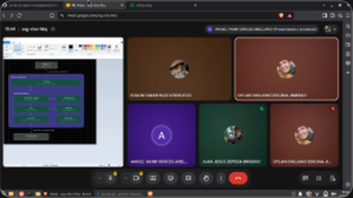

# Minuta — Junta 2

| | |
|---|---|
| **Fecha** | Lunes 21 de septiembre de 2026 |
| **Hora** | Alrededor de las 15:30 a 15:45 (según la evidencia) |
| **Medio** | Google Meet |
| **Asistentes visibles en la evidencia** | Angel Yahir Vences Arellano (presenta), Dylan Emiliano Encina Jimenez, Juan Jesus Zepeda Briseno, Edson Omar Ruiz Verduzco |

_Lista completa de asistentes: por confirmar por el equipo._

## Objetivo

Revisar las pruebas, dar contexto a las herramientas de IA que usa cada integrante, definir roles y repasar los próximos eventos del proyecto.

## Temas tratados

1. Pruebas del prototipo.
2. Contextualización de la IA de cada integrante: qué documentos y qué parte del proyecto debe conocer la herramienta que usa cada quien.
3. Definición de roles sobre la arquitectura propuesta.
4. Próximos eventos: Avance 01 y Technical Review 1.

## Lo que muestra la evidencia

| Imagen | Qué se ve |
|---|---|
| `junta2-01.png` | Ángel presenta el diagrama de arquitectura: Cliente CLI → Servicio JobRunner (Entrada; Gestión de trabajos con Control, Cola y Lanzador; Persistencia, Bitácora y Operación) → Procesos hijos |
| `junta2-02.png` | La misma sesión catorce minutos después, con el diagrama en pantalla; la barra de tareas muestra la fecha 2026-09-21 |

## Actividad relacionada en el repositorio

- Ese día se mezcló el PR #11 (plan de verificación) y se cerró el issue #6.
- En los días siguientes, el diagrama presentado se convirtió en la matriz de roles por módulo y en las decisiones de arquitectura (25 de septiembre) y en el esqueleto de `src/` (PR #12, 27 de septiembre).

## Acuerdos

- La arquitectura del servicio se organiza en los módulos del diagrama, y los roles se asignan por módulo.

_Acuerdos adicionales, responsables y fechas: por completar por el equipo._
