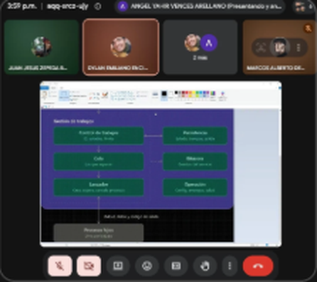

# Minuta — Junta 3

| | |
|---|---|
| **Fecha** | Lunes 28 de septiembre de 2026 |
| **Hora** | Alrededor de las 16:00 (según la evidencia) |
| **Medio** | Google Meet |
| **Asistentes visibles en la evidencia** | Angel Yahir Vences Arellano (presenta), Dylan Emiliano Encina Jimenez, Juan Jesus Zepeda Briseno, Marcos Alberto de Jesus Garcia Espino |

_Lista completa de asistentes: por confirmar por el equipo._

## Objetivo

Repartir el trabajo por módulos y acordar cómo se organizan los issues, la documentación y las pruebas del código con scripts.

## Temas tratados

1. Roles por módulo: qué archivo de `src/` implementa cada integrante.
2. Issues: un issue por tarea, asignado a su responsable.
3. Documentación: contratos de interfaz y alcance del avance.
4. Pruebas del código mediante scripts.

## Lo que muestra la evidencia

| Imagen | Qué se ve |
|---|---|
| `junta3-01.png` | Ángel presenta el detalle del diagrama: Control de trabajos (ID, estados, límite), Cola (los que esperan), Lanzador (crea, espera y cancela procesos), Persistencia (estado, tiempos, salida), Bitácora (eventos del servicio) y Operación (configuración, arranque, salud); abajo, los procesos hijos con stdout, stderr y código de salida |

## Actividad relacionada en el repositorio

- 27 de septiembre: PR #12 con el esqueleto modular de `src/` y los contratos de interfaz.
- 28 de septiembre: implementación de `cli.py`, `control.py` y `cola.py` (`d374c20`) y documento de alcance del Avance 1 (`516c7ff`).
- 29 de septiembre: issues y PR de verificación (#13 a #21): prueba de contratos, matriz de trazabilidad, casos de prueba y script de verificación.

## Acuerdos

- Cada integrante implementa únicamente las funciones definidas en el contrato de su módulo, hasta donde indica `project-management/alcance-avance-1.md`.
- Las pruebas se automatizan con scripts en `verif/scripts/`.

_Acuerdos adicionales, responsables y fechas: por completar por el equipo._
