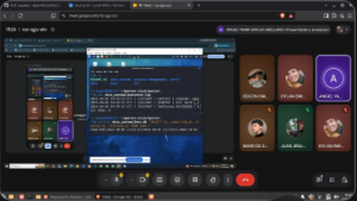
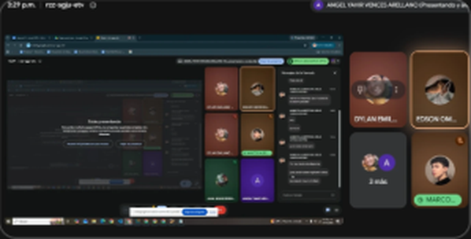

# Minuta — Junta 4

| | |
|---|---|
| **Fecha** | Jueves 1 de octubre de 2026 |
| **Hora** | Alrededor de las 15:10 a 15:30 (según la evidencia) |
| **Medio** | Google Meet |
| **Asistentes** | Angel Yahir Vences Arellano (presenta), Dylan Emiliano Encina Jimenez, Juan Jesus Zepeda Briseno, Marcos Alberto de Jesus Garcia Espino, Edson Omar Ruiz Verduzco |

## Objetivo

Actualizar la documentación, revisar los últimos detalles del Avance 01 y acordar cómo se presentará en la Technical Review 1 del 6 de octubre.

## Temas tratados

1. Actualización de la documentación del repositorio.
2. Revisión de los últimos detalles del núcleo local: persistencia y bitácora.
3. Cómo presentar: que todos puedan explicar el diagrama de arquitectura y el recorrido de una solicitud.

## Lo que muestra la evidencia

| Imagen | Qué se ve |
|---|---|
| `junta4-01.png` | Ángel muestra en su máquina virtual la bitácora `jobrunner.log` con los eventos `CREATED`, `STARTED` y `SUCCEEDED` de un trabajo, y una consulta a `jobs.db` con SQLite que devuelve el ID y los tiempos de recepción, inicio y fin |
| `junta4-02.png` | Chat de la llamada: Marcos pide el diagrama mostrado en la sesión anterior "para poder saber explicarlo todos" |

## Actividad relacionada en el repositorio

- 30 de septiembre: protocolo y entrada (PR #25), cola (PR #26) y `launcher` con `asyncio` (`d84ec9f`).
- 1 de octubre: se mezcla el PR #27 (cola y control) y se cierra el defecto #15 del `launcher`.
- 1 de octubre: README en dos versiones, cronograma y estas minutas.

## Acuerdos

- Se actualiza la documentación antes de la revisión.
- El diagrama de arquitectura se comparte con todo el equipo para que cualquier integrante pueda explicarlo.

## Pendientes para la Technical Review 1

- Subir a `main` los módulos de persistencia, bitácora y operación demostrados en esta junta.
- Prueba de punta a punta desde un clon limpio y evidencia en `verif/results/`.
- Confirmar que el repositorio esté público desde el 5 de octubre.

_Responsables y fechas de cada pendiente: por completar por el equipo._
